Metagenomics Analysis on Fungal Communities in Stone Fruit Ecosystems in
Canada
================
Minuka Hewapathirana
2024-07-19

## Investigation of Fungal Diversity in Stone Fruit Samples in BC and ON

### <span style="color:blue">(1) Loading Packages </span>

A comprehensive list of packages required to perform metagenomics
analysis for *ION torrent* data

``` r
library("knitr")
library("qiime2R") # devtools::install_github("jbisanz/qiime2R")
library("phyloseq")
library("readxl")      
library("tibble")
library("vegan")
library("DESeq2") #BiocManager::install("DESeq2")
library("speedyseq") # remotes::install_github("mikemc/speedyseq") 
library("ape")
library("ggstar")
library("forcats")
library("patchwork")
library("ggpubr")
library("plotROC")
library("viridis")
library("cowplot")
library("ggplot2")
library("microbiome") # BiocManager::install("microbiome")
library("microbiomeutilities")

library("ggtree") # BiocManager::install("ggtree")
library("ggtreeExtra") #install.packages("ggExtra")
library('MicrobiotaProcess') # BiocManager::install("MicrobiotaProcess")
#library("tidytree")
library("file2meco")
library("microeco")
```

### <span style="color:blue">(2) Read Depth Analysis </span>

Image is loaded from Ch1_Setup.md , thus we have to remove a number of
PS objects and retain only applicable PS Objects for this analysis

Observe read depth to make informed decisions about normalization or
standardization of data

``` r
#load data from previous Ch1_Setup 
load("D:\\Grad_School\\R_Projects\\BeeProject_Metagenomics\\Images\\Setup.RData")

#Remove unnessecary PSObjects
rm(PS_16S_BC_ON,PS_16S_BC_ON_BB,PS_16S_BC_ON_SF,PS_16S_Global)

#visualize the objects
PS_ITS1R_BC_ON_SF
```

    ## phyloseq-class experiment-level object
    ## otu_table()   OTU Table:          [ 11005 taxa and 138 samples ]:
    ## sample_data() Sample Data:        [ 138 samples by 15 sample variables ]:
    ## tax_table()   Taxonomy Table:     [ 11005 taxa by 7 taxonomic ranks ]:
    ## phy_tree()    Phylogenetic Tree:  [ 11005 tips and 10923 internal nodes ]:
    ## taxa are rows

``` r
#Visualize the metadatafile
kable(head(meta(PS_ITS1R_BC_ON_SF)), digits = 2, align = c(rep("l", 4), rep("c", 4), rep("r", 4)))
```

|     | barcode.seqeunce | linker.primer.seqeunce     | InputFileName              | Description | RunNumber | SampleName  | Number | Province |       Location | Plant | Sample.type | Site | DateCollected | Colony | DNANg |
|:----|:-----------------|:---------------------------|:---------------------------|:------------|:---------:|:-----------:|:------:|:--------:|---------------:|------:|------------:|-----:|:--------------|:-------|:------|
| A01 | CTAAGGTAA        | CGATCTTGGTCATTTAGAGGAAGTAA | A01_9_L001_R1_001.fastq.gz | ITS2_A_B01  |  BCC_R1   | BCCV1-AP-1B |   1    |    BC    | Creston Valley | Apple |       Bread |    1 | Spring 2021   | 1      | 1.16  |
| A02 | TAAGGAGAA        | CGATCTTGGTCATTTAGAGGAAGTAA | A02_9_L001_R1_001.fastq.gz | ITS2_A_B02  |  BCC_R1   | BCCV1-AP-2B |   2    |    BC    | Creston Valley | Apple |       Bread |    1 | Spring 2021   | 2      | 0.74  |
| A03 | AAGAGGATT        | CGATCTTGGTCATTTAGAGGAAGTAA | A03_9_L001_R1_001.fastq.gz | ITS2_A_B03  |  BCC_R1   | BCCV1-AP-3B |   3    |    BC    | Creston Valley | Apple |       Bread |    1 | Spring 2021   | 3      | 0.87  |
| A04 | TACCAAGAT        | CGATCTTGGTCATTTAGAGGAAGTAA | A04_9_L001_R1_001.fastq.gz | ITS2_A_B04  |  BCC_R1   | BCCV2-AP-1B |   4    |    BC    | Creston Valley | Apple |       Bread |    2 | Spring 2021   | 1      | 0.56  |
| A05 | CAGAAGGAA        | CGATCTTGGTCATTTAGAGGAAGTAA | A05_9_L001_R1_001.fastq.gz | ITS2_A_B05  |  BCC_R1   | BCCV2-AP-2B |   5    |    BC    | Creston Valley | Apple |       Bread |    2 | Spring 2021   | 2      | 0.99  |
| A06 | CTGCAAGTT        | CGATCTTGGTCATTTAGAGGAAGTAA | A06_9_L001_R1_001.fastq.gz | ITS2_A_B06  |  BCC_R1   | BCCV2-AP-3B |   6    |    BC    | Creston Valley | Apple |       Bread |    2 | Spring 2021   | 3      | 0.52  |

``` r
#meta(PS_ITS1R_BC_ON_SF)

#Read depth analysis processing
Read_Depth_PS_ITS1R_BC_ON_SF<-plot_read_distribution(PS_ITS1R_BC_ON_SF, groups = "Province", 
                             plot.type = "histogram")+
  theme_biome_utils()+
  scale_x_continuous(trans='log10')+
  scale_fill_manual(values=c("#111111"))+ 
  theme(legend.position="none")+
  labs(title = "Read Histogram Distribution",x = "Number of Reads", y = "Count")

#Visualize
Read_Depth_PS_ITS1R_BC_ON_SF
```

<!-- -->

### <span style="color:blue">(3) Singleton Removal </span>

A singleton is defined as a read that occurs uniquely in the dataset.
Normally, we remove singletons as they are usually artifacts generated
from sequencing error.

Here we identify <span style="color:red">4563 singletons </span> and we
remove them to create a **Pruned** PS Object

``` r
#Summarize the PS Object to observe singletons 
summarize_phyloseq(PS_ITS1R_BC_ON_SF)
```

    ## [[1]]
    ## [1] "1] Min. number of reads = 7904"
    ## 
    ## [[2]]
    ## [1] "2] Max. number of reads = 1422317"
    ## 
    ## [[3]]
    ## [1] "3] Total number of reads = 22291019"
    ## 
    ## [[4]]
    ## [1] "4] Average number of reads = 161529.123188406"
    ## 
    ## [[5]]
    ## [1] "5] Median number of reads = 108408.5"
    ## 
    ## [[6]]
    ## [1] "7] Sparsity = 0.993258663716756"
    ## 
    ## [[7]]
    ## [1] "6] Any OTU sum to 1 or less? YES"
    ## 
    ## [[8]]
    ## [1] "8] Number of singletons = 4563"
    ## 
    ## [[9]]
    ## [1] "9] Percent of OTUs that are singletons \n        (i.e. exactly one read detected across all samples)0"
    ## 
    ## [[10]]
    ## [1] "10] Number of sample variables are: 15"
    ## 
    ## [[11]]
    ##  [1] "barcode.seqeunce"       "linker.primer.seqeunce" "InputFileName"         
    ##  [4] "Description"            "RunNumber"              "SampleName"            
    ##  [7] "Number"                 "Province"               "Location"              
    ## [10] "Plant"                  "Sample.type"            "Site"                  
    ## [13] "DateCollected"          "Colony"                 "DNANg"

``` r
#Number of singletons = 4563

#We need to remove the so we remove any taxa sums that are less than 2 reads, so we use the prune_taxa function 
PS_ITS1R_BC_ON_SF_Pruned = prune_taxa(taxa_sums(PS_ITS1R_BC_ON_SF) > 02, PS_ITS1R_BC_ON_SF)

PS_ITS1R_BC_ON_SF_Pruned
```

    ## phyloseq-class experiment-level object
    ## otu_table()   OTU Table:          [ 6377 taxa and 138 samples ]:
    ## sample_data() Sample Data:        [ 138 samples by 15 sample variables ]:
    ## tax_table()   Taxonomy Table:     [ 6377 taxa by 7 taxonomic ranks ]:
    ## phy_tree()    Phylogenetic Tree:  [ 6377 tips and 6338 internal nodes ]:
    ## taxa are rows

``` r
summarize_phyloseq(PS_ITS1R_BC_ON_SF_Pruned)
```

    ## [[1]]
    ## [1] "1] Min. number of reads = 7904"
    ## 
    ## [[2]]
    ## [1] "2] Max. number of reads = 1422313"
    ## 
    ## [[3]]
    ## [1] "3] Total number of reads = 22290889"
    ## 
    ## [[4]]
    ## [1] "4] Average number of reads = 161528.18115942"
    ## 
    ## [[5]]
    ## [1] "5] Median number of reads = 108408.5"
    ## 
    ## [[6]]
    ## [1] "7] Sparsity = 0.988440114269351"
    ## 
    ## [[7]]
    ## [1] "6] Any OTU sum to 1 or less? NO"
    ## 
    ## [[8]]
    ## [1] "8] Number of singletons = 0"
    ## 
    ## [[9]]
    ## [1] "9] Percent of OTUs that are singletons \n        (i.e. exactly one read detected across all samples)0"
    ## 
    ## [[10]]
    ## [1] "10] Number of sample variables are: 15"
    ## 
    ## [[11]]
    ##  [1] "barcode.seqeunce"       "linker.primer.seqeunce" "InputFileName"         
    ##  [4] "Description"            "RunNumber"              "SampleName"            
    ##  [7] "Number"                 "Province"               "Location"              
    ## [10] "Plant"                  "Sample.type"            "Site"                  
    ## [13] "DateCollected"          "Colony"                 "DNANg"

Singletons were successfully removed as singleton count = 0

### <span style="color:blue">(4) Observation of Ubiqitous species</span>

Now I generated a **relative abundance** profile for all fungal hits in
the pruned object. We observe a number of species that are considered
**ubiquitous** and not necessary for the goals of the project.

``` r
#top_taxa(PS_ITS1R_BC_ON_SF_Pruned)

#Utilzation of taxalevel 7 to obtain species level detections
classtaxa_ITS1R_BC_ON_SF_Pruned <- get_taxadf(obj=PS_ITS1R_BC_ON_SF_Pruned, taxlevel=7)
# The 50 most abundant taxonomy will be visualized by default (parameter `topn=50`). 
TopTaxa_ITS1R_BC_ON_SF_Pruned<- ggbartax(obj=classtaxa_ITS1R_BC_ON_SF_Pruned, 
                   facetNames="Province", 
                   plotgroup=TRUE, 
                   topn=50) +
  xlab(NULL) +
  ylab("Relative abundance (%)") +
  guides(fill= guide_legend(keywidth = 0.5, keyheight = 0.5, ncol=4))

TopTaxa_ITS1R_BC_ON_SF_Pruned
```

<!-- -->

``` r
#Take a closer look at the species we can remove by creating a taxa table
Taxa_Table_ITS1R_BC_ON_SF_Pruned<- as.data.frame(phyloseq::tax_table(PS_ITS1R_BC_ON_SF_Pruned))

#Taxa_Table_ITS1R_BC_ON_SF_Pruned

kable(head(meta(Taxa_Table_ITS1R_BC_ON_SF_Pruned)), digits = 2, align = c(rep("l", 4), rep("c", 4), rep("r", 4)))
```

| Kingdom | Phylum     | Class           | Order             |      Family      |     Genus     |        Species        |
|:--------|:-----------|:----------------|:------------------|:----------------:|:-------------:|:---------------------:|
| Fungi   | Ascomycota | Saccharomycetes | Saccharomycetales | Phaffomycetaceae | Cyberlindnera | Cyberlindnera_jadinii |
| Fungi   | Ascomycota | Saccharomycetes | Saccharomycetales | Phaffomycetaceae | Cyberlindnera | Cyberlindnera_jadinii |
| Fungi   | Ascomycota | Saccharomycetes | Saccharomycetales | Phaffomycetaceae | Cyberlindnera | Cyberlindnera_jadinii |
| Fungi   | Ascomycota | Saccharomycetes | Saccharomycetales | Phaffomycetaceae | Cyberlindnera | Cyberlindnera_jadinii |
| Fungi   | Ascomycota | Saccharomycetes | Saccharomycetales | Phaffomycetaceae | Cyberlindnera | Cyberlindnera_jadinii |
| Fungi   | Ascomycota | Saccharomycetes | Saccharomycetales | Phaffomycetaceae | Cyberlindnera | Cyberlindnera_jadinii |

Based on the above relative abundance profile, we observe high abundance
of *Cladosporium herbarum* and through taxa_tables we identify high
levels of *Saccharomycetes* and *N/A* hits.

We aim to remove these in the next code chunk We remove them using a
subsetting strategy, where we create subsets of the pruned object and
keep removing specific organisms based on phylum.

``` r
# Removal of ubiqitous species and unknown phylums 
# We generate a new Filtered object by continiously removing certain species and phylum
PS_ITS1R_BC_ON_SF_Filtered <- subset_taxa(PS_ITS1R_BC_ON_SF_Pruned, Species !="Cladosporium_herbarum")
PS_ITS1R_BC_ON_SF_Filtered <- subset_taxa(PS_ITS1R_BC_ON_SF_Filtered, Species !="Cladosporium_sp")
PS_ITS1R_BC_ON_SF_Filtered <- subset_taxa(PS_ITS1R_BC_ON_SF_Filtered, Class!="Saccharomycetes")
PS_ITS1R_BC_ON_SF_Filtered <- subset_taxa(PS_ITS1R_BC_ON_SF_Filtered, Phylum!="N/A")

PS_ITS1R_BC_ON_SF_Filtered
```

    ## phyloseq-class experiment-level object
    ## otu_table()   OTU Table:          [ 3916 taxa and 138 samples ]:
    ## sample_data() Sample Data:        [ 138 samples by 15 sample variables ]:
    ## tax_table()   Taxonomy Table:     [ 3916 taxa by 7 taxonomic ranks ]:
    ## phy_tree()    Phylogenetic Tree:  [ 3916 tips and 3896 internal nodes ]:
    ## taxa are rows

``` r
#Re-checking the Filtered object to check if filtering via subsetting worked?

classtaxa_ITS1R_BC_ON_SF_Filtered <- get_taxadf(obj=PS_ITS1R_BC_ON_SF_Filtered, taxlevel=7)
# The 30 most abundant taxonomy will be visualized by default (parameter `topn=30`). 
TopTaxa_ITS1R_BC_ON_SF_Filtered<- ggbartax(obj=classtaxa_ITS1R_BC_ON_SF_Filtered, 
                   facetNames="Province", 
                   plotgroup=TRUE, 
                   topn=50) +
  xlab(NULL) +
  ylab("Relative abundance (%)") +
  guides(fill= guide_legend(keywidth = 0.5, keyheight = 0.5, ncol=4))

TopTaxa_ITS1R_BC_ON_SF_Filtered
```

<!-- -->

Observing the relative abundance charts we can see that *Cladosporium
herbarum* and other phylum not required are removed successfully.

### <span style="color:blue">(5) Alpha Diversity Analysis</span>

``` r
#utilize get_alphaindex to obtain alpha indexes for the filtered PS object 
alphaobj_Stonefruit<- get_alphaindex(PS_ITS1R_BC_ON_SF_Filtered)

#Observe Analysis
Observe_status <- ggbox(alphaobj_Stonefruit, 
                        geom="violin", 
                        factorNames="Province",   
                        compare = TRUE,
                        testmethod = "wilcox.test",
                        signifmap = TRUE,
                        indexNames="Observe")+ 
  labs(title = "Observed Fungal Alpha Diversity by Provinces") + ylab("Observed Features per Sample") + xlab("Province")+
  theme(aspect.ratio = 0.5)+
  theme(text = element_text(size = 12))+
  theme( legend.position="none")+
  theme(strip.background = element_rect(colour=NA, fill="grey"))+
  scale_fill_manual(values=c("#990038", 
                                      "#01AED9",
                                      "#000000",
                                      "#1B9E77", 
                                      "#000033", 
                                      "#FD9347"))


Observe_status
```

<!-- -->

### <span style="color:blue">(6) Heatmap of Relative Abundance of Fungal Detections</span>

We use functions to convert the PS object to a Meco object and represent
this object using ***microeco*** package

Heatmaps offer a visual representation of taxonomic detections based on
experiment parameters

``` r
#Object Conversion 
Meco_SF <- phyloseq2meco(PS_ITS1R_BC_ON_SF_Filtered)

Heatmap_SF <- trans_abund$new(dataset = Meco_SF, 

                      taxrank = "Species", 

                      ntaxa = 20)

#this heatmap is plotted based on Province and Sample Type
Heatmap_SF$plot_heatmap(facet = c("Province","Sample.type"),
                color_values = rev(RColorBrewer::brewer.pal(n = 11, 
                                                            name = "Spectral")),
                xtext_keep = FALSE, 
                withmargin = TRUE)
```

<!-- -->

Based on the above heatmap we can identify some pathogenic species to
**bees**: - *Ascospahera apis* - *Bettsia alvei*

Based on the above heatmap we can identify some pathogenic species and
genus to **plants**: - *Alternaria prunicola* - *Podosphaera
leuctoricha* - *Blumeria graminis* - *Botrytis_sp*

### <span style="color:blue">(7) Specific Phylogenetic Subsets</span>

Based on knowledge of plant pathogens , we can create sub objects of the
filtered PS object to consist of a specific genus and attempt to target
certain pathogenic species

1)  *Penicillium Expansum* - blue mold of apples

``` r
PS_ITS1R_Penicillium <- subset_taxa(PS_ITS1R_BC_ON_SF_Filtered, Genus == "Penicillium")

plot_tree(tax_glom(PS_ITS1R_Penicillium, 
                   taxrank="Species"),
          method = "sampledodge",
          ladderize="left",
          nodelabf=nodeplotblank, 
          color="Plant", 
          label.tips="Species", 
          text.size=3, 
          base.spacing=0.01,
          justify="jagged",
          shape="Province",
          size="abundance",
          plot.margin =0.9)+
  scale_size_continuous(range = c(0.0001, 4))
```

<!-- -->

2)  *Alternaria prunicola* - Cherry leaf spot

For a more complete phylogenetic tree we subset based on the family
*Pleosporaceae*

``` r
PS_ITS1R_BC_ON_SF_Pleosporaceae <- subset_taxa(PS_ITS1R_BC_ON_SF_Filtered, Family =="Pleosporaceae")

PS_ITS1R_BC_ON_SF_Pleosporaceae
```

    ## phyloseq-class experiment-level object
    ## otu_table()   OTU Table:          [ 134 taxa and 138 samples ]:
    ## sample_data() Sample Data:        [ 138 samples by 15 sample variables ]:
    ## tax_table()   Taxonomy Table:     [ 134 taxa by 7 taxonomic ranks ]:
    ## phy_tree()    Phylogenetic Tree:  [ 134 tips and 130 internal nodes ]:
    ## taxa are rows

``` r
plot_tree(tax_glom(PS_ITS1R_BC_ON_SF_Pleosporaceae, 
                   taxrank="Species"),
          method = "sampledodge",
          ladderize="left",
          nodelabf=nodeplotblank, 
          color="Plant", 
          label.tips="Species", 
          text.size=3, 
          base.spacing=0.01,
          justify="jagged",
          shape="Location",
          size="abundance",
          plot.margin =0.9)+
  scale_size_continuous(range = c(0.0001, 4))
```

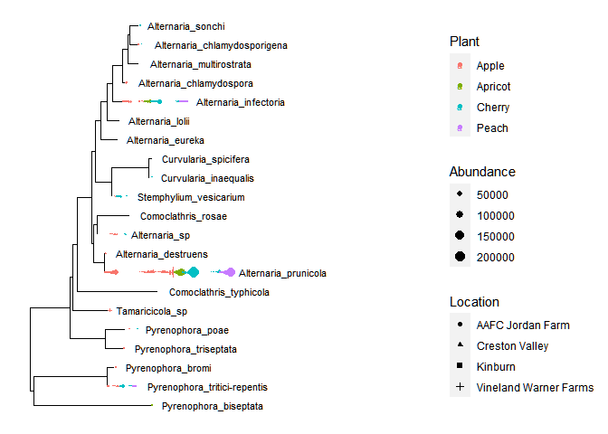<!-- -->

``` r
# Heatmap analysis for alternative view of detections based on sample type 
meco_PS_ITS1R_BC_ON_SF_Pleosporaceae<- phyloseq2meco(PS_ITS1R_BC_ON_SF_Pleosporaceae)

 
b1_PS_ITS1R_BC_ON_SF_Pleosporaceae <- trans_abund$new(dataset = meco_PS_ITS1R_BC_ON_SF_Pleosporaceae, 

                      taxrank = "Species", 

                      ntaxa = 8)
```

    ## microtable-class object:
    ## sample_table have 114 rows and 15 columns
    ## otu_table have 134 rows and 114 columns
    ## tax_table have 134 rows and 7 columns
    ## phylo_tree have 134 tips

``` r
b1_PS_ITS1R_BC_ON_SF_Pleosporaceae$plot_heatmap(facet = c("Province","Sample.type"),
                color_values = rev(RColorBrewer::brewer.pal(n = 11, 
                                                            name = "Spectral")),
                xtext_keep = FALSE, 
                withmargin = TRUE)
```

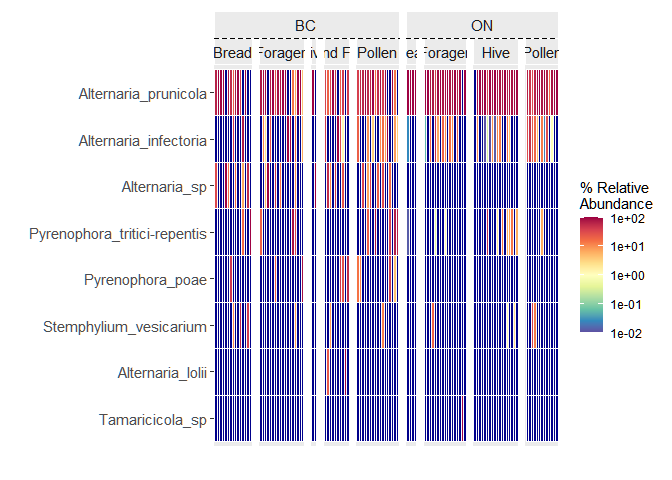<!-- -->

**NOTE** : The heatmaps may look difficult to visualize here hwoever
when run in Rstudio environment, it is possible to export to PNG and
have a clearer output

2)  *Monilinia_sp* - Brown Rot

For a more complete phylogenetic tree we subset based on the family
*Sclerotiniaceae*

``` r
PS_ITS1R_Sclero <- subset_taxa(PS_ITS1R_BC_ON_SF_Filtered, Family =="Sclerotiniaceae")

plot_tree(tax_glom(PS_ITS1R_Sclero, 
                   taxrank="Species"),
          method = "sampledodge",
          ladderize="left",
          nodelabf=nodeplotblank, 
          color="Sample.type", 
          label.tips="Species", 
          text.size=5, 
          base.spacing=0.01,
          justify="jagged",
          shape="Province",
          size="abundance",
          plot.margin =0.9)+
  scale_size_continuous(range = c(0.0001, 4))
```

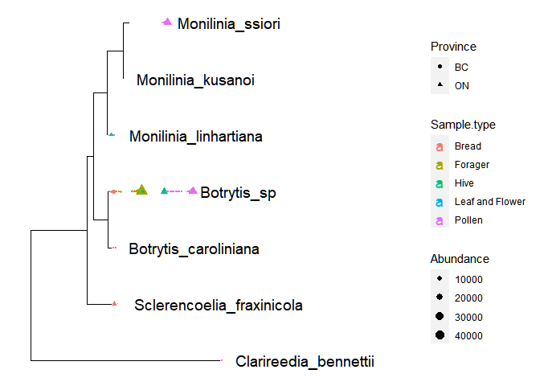<!-- -->

``` r
meco_ITS2_BC_ON_SF_Sclerotiniaceae<- phyloseq2meco(PS_ITS1R_Sclero)

 
ITS2_BC_ON_SF_Sclerotiniaceae <- trans_abund$new(dataset = meco_ITS2_BC_ON_SF_Sclerotiniaceae, 

                      taxrank = "Species", 

                      ntaxa = 15)
```

    ## microtable-class object:
    ## sample_table have 57 rows and 15 columns
    ## otu_table have 50 rows and 57 columns
    ## tax_table have 50 rows and 7 columns
    ## phylo_tree have 50 tips

``` r
ITS2_BC_ON_SF_Sclerotiniaceae$plot_heatmap(facet = c("Province","Sample.type"),
                color_values = rev(RColorBrewer::brewer.pal(n = 11, 
                                                            name = "Spectral")),
                xtext_keep = FALSE, 
                withmargin = TRUE)
```

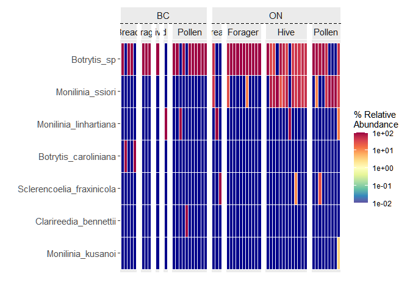<!-- -->

3)  *Podosphaera Leucotricha* - Powdery Mildew

For a more complete phylogenetic tree we subset based on the family
*Erysiphaceae*

``` r
PS_ITS2_BC_ON_SF_Erysiphaceae <- subset_taxa(PS_ITS1R_BC_ON_SF_Filtered, Family == "Erysiphaceae")

plot_tree(tax_glom(PS_ITS2_BC_ON_SF_Erysiphaceae, 
                   taxrank="Species"),
          method = "sampledodge",
          ladderize="left",
          nodelabf=nodeplotblank, 
          color="Plant", 
          label.tips="Species", 
          text.size=3, 
          base.spacing=0.01,
          justify="jagged",
          shape="Province",
          size="abundance",
          plot.margin =0.9)+
  scale_size_continuous(range = c(0.0001, 4))
```

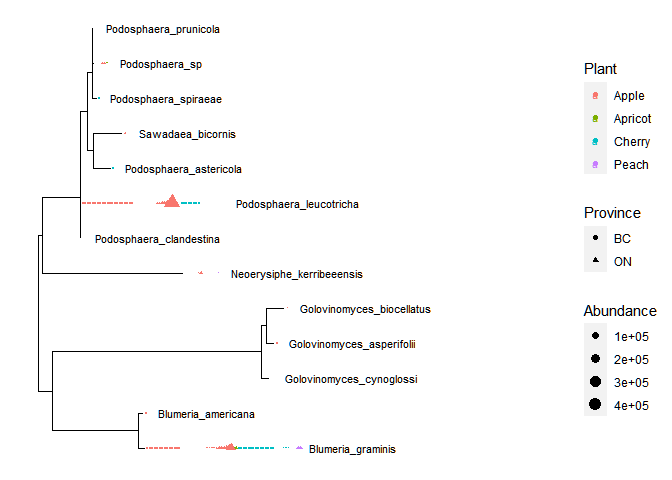<!-- -->

``` r
##HEATMAP
meco_ITS2_BC_ON_SF_Erysiphaceae<- phyloseq2meco(PS_ITS2_BC_ON_SF_Erysiphaceae)

 
b1_ITS2_BC_ON_SF_Erysiphaceae <- trans_abund$new(dataset = meco_ITS2_BC_ON_SF_Erysiphaceae, 

                      taxrank = "Species", 

                      ntaxa = 8)
```

    ## microtable-class object:
    ## sample_table have 85 rows and 15 columns
    ## otu_table have 144 rows and 85 columns
    ## tax_table have 144 rows and 7 columns
    ## phylo_tree have 144 tips

``` r
b1_ITS2_BC_ON_SF_Erysiphaceae$plot_heatmap(facet = c("Province","Sample.type"),
                color_values = rev(RColorBrewer::brewer.pal(n = 11, 
                                                            name = "Spectral")),
                xtext_keep = FALSE, 
                withmargin = TRUE)
```

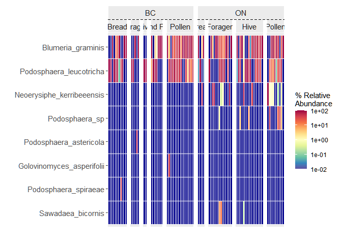<!-- -->

4)  *Cytospora Cinnamomea* - Cherry Canker Disease

For a more complete phylogenetic tree we subset based on the genus
*Cytospora*

``` r
PS_ITS1R_Cytospora <- subset_taxa(PS_ITS1R_BC_ON_SF_Filtered, Genus == "Cytospora")

plot_tree(tax_glom(PS_ITS1R_Cytospora, 
                   taxrank="Species"),
          method = "sampledodge",
          ladderize="left",
          nodelabf=nodeplotblank, 
          color="Sample.type", 
          label.tips="Species", 
          text.size=3, 
          base.spacing=0.01,
          justify="jagged",
          shape="Province",
          size="abundance",
          plot.margin =0.9)+
  scale_size_continuous(range = c(0.0001, 4))
```

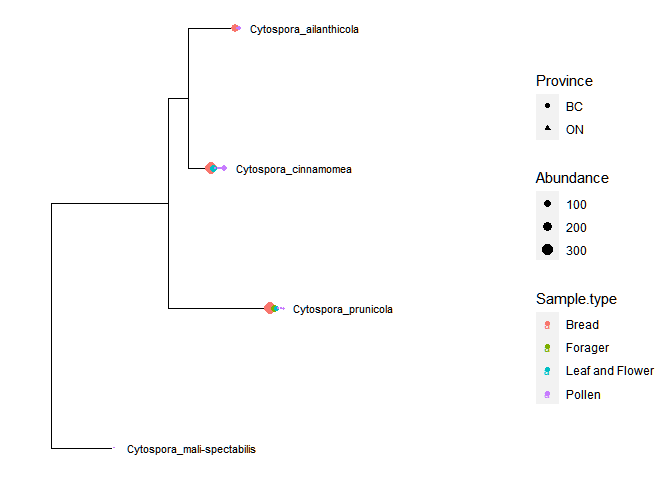<!-- -->

``` r
##HEATMAP
meco_ITS1R_Cytospora<- phyloseq2meco(PS_ITS1R_Cytospora)

 
b1_ITS1R_Cytospora <- trans_abund$new(dataset = meco_ITS1R_Cytospora, 

                      taxrank = "Species", 

                      ntaxa = 8)
```

    ## microtable-class object:
    ## sample_table have 17 rows and 15 columns
    ## otu_table have 15 rows and 17 columns
    ## tax_table have 15 rows and 7 columns
    ## phylo_tree have 15 tips

``` r
b1_ITS1R_Cytospora$plot_heatmap(facet = c("Province","Plant","Sample.type"),
                color_values = rev(RColorBrewer::brewer.pal(n = 11, 
                                                            name = "Spectral")),
                xtext_keep = FALSE, 
                withmargin = TRUE)
```

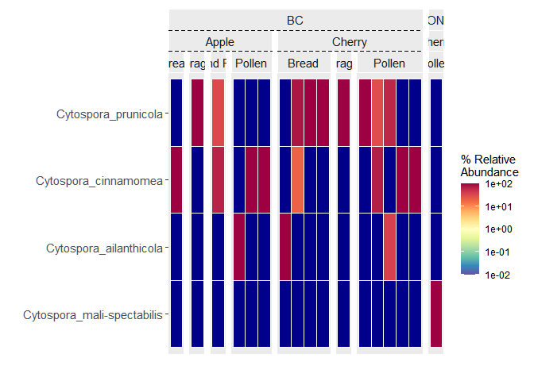<!-- -->

5)  *Ascosphaera Apis* - Chalkbrood Disease

For a more complete phylogenetic tree we subset based on the family
*Ascosphaeraceae*

``` r
##BEE PATHOGENS

PS_ITS2_BC_ON_SF_Ascosphaeraceae <- subset_taxa(PS_ITS1R_BC_ON_SF_Filtered, Family == "Ascosphaeraceae")

plot_tree(tax_glom(PS_ITS2_BC_ON_SF_Ascosphaeraceae, 
                   taxrank="Species"),
          method = "sampledodge",
          ladderize="left",
          nodelabf=nodeplotblank, 
          color="Plant", 
          label.tips="Species", 
          text.size=3, 
          base.spacing=0.01,
          justify="jagged",
          shape="Province",
          size="abundance",
          plot.margin =0.9)+
  scale_size_continuous(range = c(0.0001, 4))
```

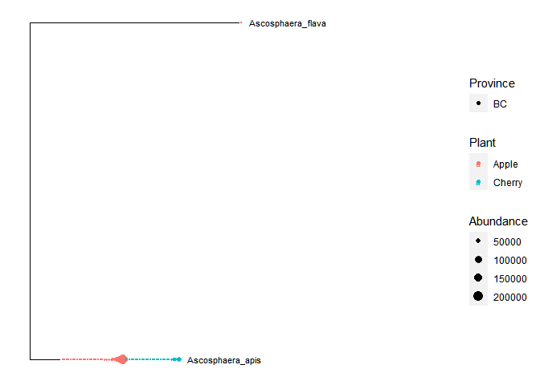<!-- -->

``` r
##HEATMAP
meco_ITS2_BC_ON_SF_Ascosphaeraceae<- phyloseq2meco(PS_ITS2_BC_ON_SF_Ascosphaeraceae)

 
b1_ITS2_BC_ON_SF_Ascosphaeraceae <- trans_abund$new(dataset = meco_ITS2_BC_ON_SF_Ascosphaeraceae, 

                      taxrank = "Species", 

                      ntaxa = 10)
```

    ## microtable-class object:
    ## sample_table have 57 rows and 15 columns
    ## otu_table have 40 rows and 57 columns
    ## tax_table have 40 rows and 7 columns
    ## phylo_tree have 40 tips

``` r
b1_ITS2_BC_ON_SF_Ascosphaeraceae$plot_heatmap(facet = c("Province","Plant","Sample.type"),
                color_values = rev(RColorBrewer::brewer.pal(n = 11, 
                                                            name = "Spectral")),
                xtext_keep = FALSE, 
                withmargin = TRUE)
```

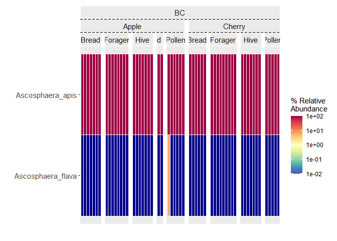<!-- -->

6)  *Bettsia alvei* - Pollen Mould Disease

For a more complete phylogenetic tree we subset based on the family
*Pseudeurotiaceae*

``` r
PS_ITS2_BC_ON_SF_Pseudeurotiaceae <- subset_taxa(PS_ITS1R_BC_ON_SF_Filtered, Family == "Pseudeurotiaceae")

plot_tree(tax_glom(PS_ITS2_BC_ON_SF_Pseudeurotiaceae, 
                   taxrank="Species"),
          method = "sampledodge",
          ladderize="left",
          nodelabf=nodeplotblank, 
          color="Plant", 
          label.tips="Species", 
          text.size=3, 
          base.spacing=0.01,
          justify="jagged",
          shape="Province",
          size="abundance",
          plot.margin =0.9)+
  scale_size_continuous(range = c(0.0001, 4))
```

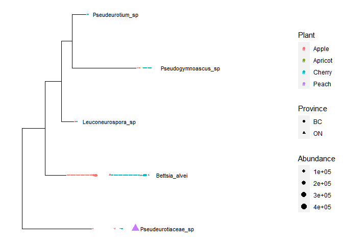<!-- -->

``` r
##HEATMAP
meco_ITS2_BC_ON_SF_Pseudeurotiaceae<- phyloseq2meco(PS_ITS2_BC_ON_SF_Pseudeurotiaceae)

 
b1_ITS2_BC_ON_SF_Pseudeurotiaceae<- trans_abund$new(dataset = meco_ITS2_BC_ON_SF_Pseudeurotiaceae, 

                      taxrank = "Species", 

                      ntaxa = 10)
```

    ## microtable-class object:
    ## sample_table have 99 rows and 15 columns
    ## otu_table have 78 rows and 99 columns
    ## tax_table have 78 rows and 7 columns
    ## phylo_tree have 78 tips

``` r
b1_ITS2_BC_ON_SF_Pseudeurotiaceae$plot_heatmap(facet = c("Province","Plant","Sample.type"),
                color_values = rev(RColorBrewer::brewer.pal(n = 11, 
                                                            name = "Spectral")),
                xtext_keep = FALSE, 
                withmargin = TRUE)
```

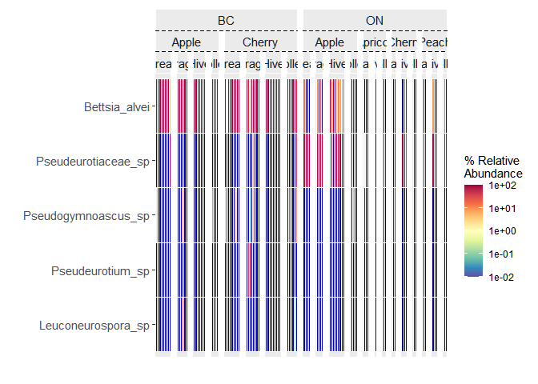<!-- -->
